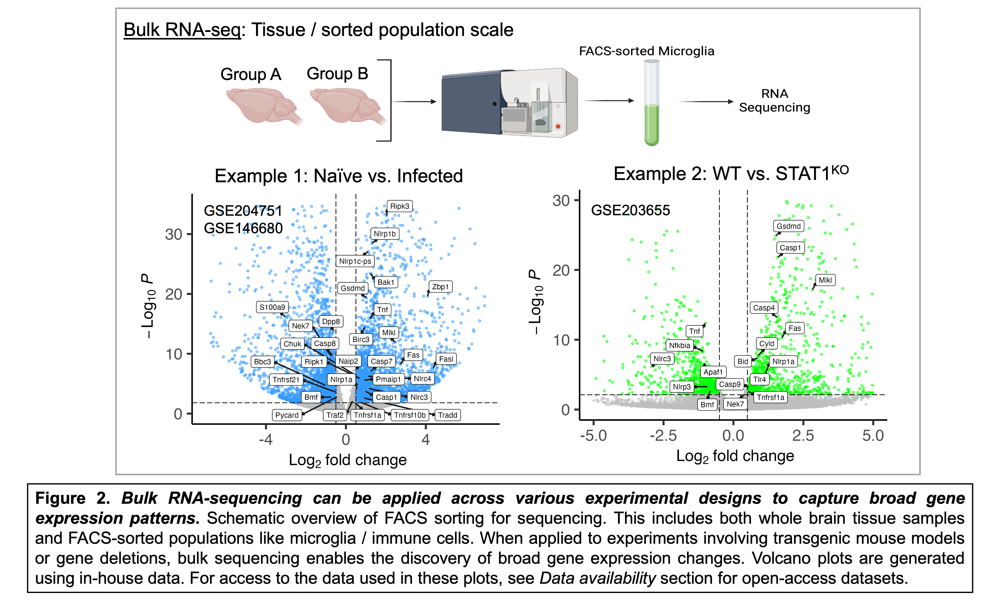
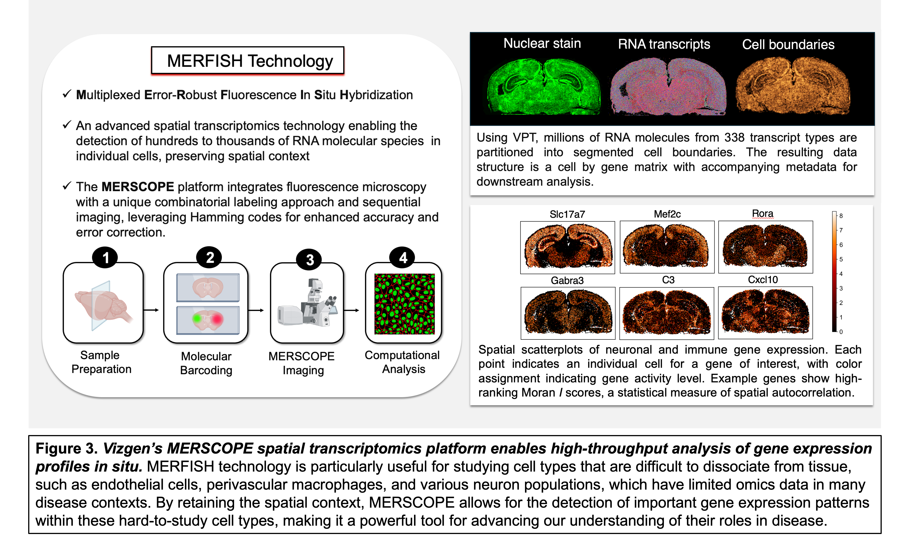
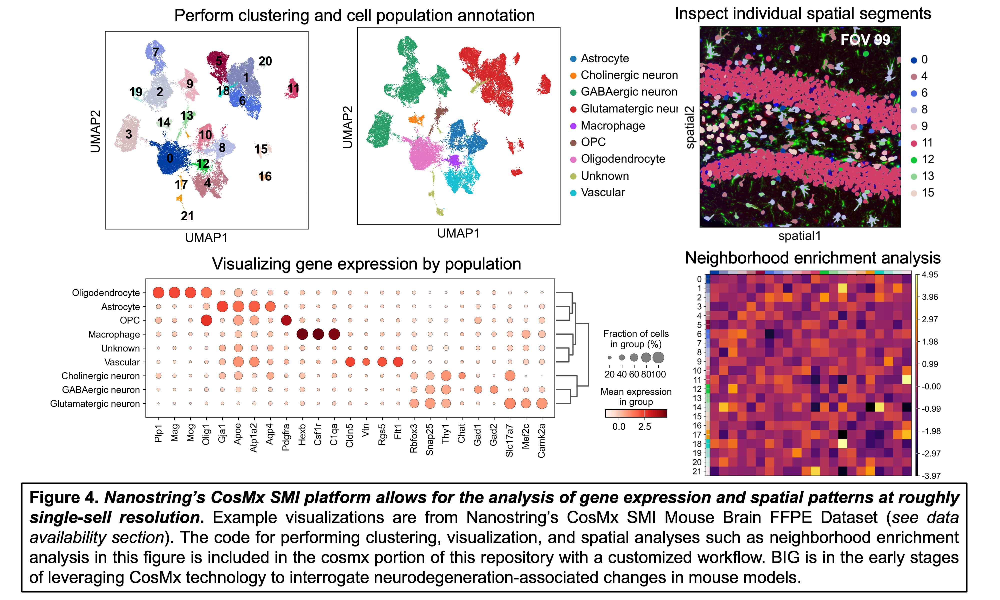
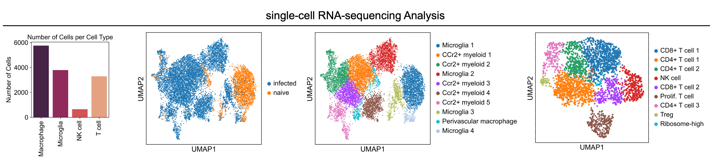

# Table of Contents
1. [About](#about) - Overview of the repository and its purpose, including the BIG Center and research focus.
2. [Code](#code) - Pipelines for transcriptomic and spatial biology analysis.
   - [Data Processing & Analysis Pipelines](#data-processing--analysis-pipelines) - Bulk RNA-seq, MERFISH, CosMx SMI, GeoMx DSP, scRNA-seq, snRNA-seq.
   - [Additional Code Sections](#additional-code-sections) - Visualizations (`visualization`), environment configurations (`envs`), and bioinformatics tools (`tools`).
3. [Experimental Design](#experimental-design) - Guidelines for picking the right technology and designing transcriptomic experiments to ensure quality and reproducibility.
4. [FAIR Data Principles](#fair-data-principles) - Ensuring adherence to FAIR standards (Findability, Accessibility, Interoperability, Reusability).
5. [Data Availability](#data-availability) - Links to publicly available datasets on GEO, most of which are generated in-house by BIG center trainees.

---

# About

I am developing this code repository as a shared resource for the **Center for Brain Immunology and Glia (BIG)**. The BIG Center at UVA is a collaborative group of biomedical researchers dedicated to the investigation of the initiation, development, and regulation of **inflammatory processes** across diverse neurological states. BIG laboratories research fundamental principles of immunology as they pertain to preclinical experimental models for CNS infection, Alzheimer's disease, multiple sclerosis, traumatic brain injury, stroke, and epilepsy. 

## Code and Pipelines

This repository houses a collection of **data pipelines** and example workflows to support the computational analysis of diverse transcriptomic and **spatial biology experiments** performed in the BIG Center. All pipelines were built using **open-source tools**, particularly within the Python ecosystem, and leverage the `scverse` bioinformatics framework. The modularity and **interoperability** of these tools ensure that each pipeline can easily be adapted or scaled.

---

# Code

## Data Processing & Analysis Pipelines

### 1. `bulk-RNA-seq-data`
Start with .fastq files from paired-end sequencing and run a trimmomatic-salmon pipeline. Read data into an R environment and proceed with a DESeq2-driven analysis. Also includes code for gene ontology overrepresentation analysis for differential expression results. The featured dataset is a sequencing experiment from control and *T. gondii*-infected brains. This dataset (Harris lab) was generated to obtain infection-specific FPKM (abundance) values to guide the creation of 500 and 1000-plex MERFISH panels, with the goal of preventing optical crowding during data generation.

- **[Bulk-seq data pipeline](https://github.com/maureennc/big-omics-pipelines/tree/main/bulk-rna-seq-data)**

---

### 2. `merfish-data`
Perform segmentation, data processing, and computational analysis on in-house MERFISH data collected from control and *T. gondii*-infected mouse brains (Harris lab). Segmentation is performed on the Rivanna/Afton HPC using the cellpose 2.0 cyto2 algorithm via the Vizgen post-processing tool (VPT). After segmentation, transcripts are partitioned into cell boundaries. The dataset is imported into a Python environment and assembled into an AnnData object for single-cell and spatial analysis. See [MERFISH poster PDF](visualization/figures/MERFISH_HPC_Pipeline_Cowan_RCSymposium2024_poster.pdf) for a comprehensive overview of the computational workflow and **pilot study results** using a custom-designed 338-gene MERFISH panel.

- **[MERFISH data pipeline](https://github.com/maureennc/big-omics-pipelines/tree/main/merfish-data)**

---

### 3. `nanostring-cosmx-data`
Prepare and analyze Nanostring CosMx SMI data. The example workflow features Nanostring demo data and a mouse brain dataset from an aging-associated Neuro-COVID19 project (Lukens lab). CosMx data is pre-processed using AtoMx software with cellpose segmentation before transferring to an AWS S3 bucket for subsequent processing using a group-specific cloud-computing setup. Data exploration and analysis performed in Python.

- **[CosMx data pipeline](https://github.com/maureennc/big-omics-pipelines/tree/main/nanostring-cosmx-data)**

---

### 4. `nanostring-geomx-data`
Prepare and analyze Nanostring GeoMx Digital Spatial Profiler (DSP) data. ROI-based spatial data is analyzed using the `GeoMx tools` Bioconductor package. Workflow includes reading in data, filtering, Q3-normalization, and differential expression using LMMs. The featured dataset is from the mouse olfactory system during SARS-CoV-2 infection (Lukens lab). Advanced data visualization included transforming gene expression data into barycentric coordinates for three-way plotting using the [triwise](https://github.com/saeyslab/triwise) package.

- **[GeoMx data pipeline](https://github.com/maureennc/big-omics-pipelines/tree/main/nanostring-cosmx-data)**

---

### 5. `scRNA-seq-data`
Run cellranger and perform single-cell analysis on our in-house 10x Genomics data generated in collaboration with  [UVA's Sequencing Core](https://med.virginia.edu/gatc/). The dataset features immune cells FACS-sorted from *T. gondii*-infected mouse brains (Harris lab). Data cleaning involves filtering on QC parameters using a dynamic quantile approach and scrublet for doublet detection. This section includes example scripts for cell type annotation and identification and differential expression. Trajectory inference analysis (RNA velocity) is performed to examine the microglial transition from homeostatic to a neurodegeneration-associated transcriptional state during parasitic infection using tools including samtools, velocyto, and scVelo. Analysis and visualization performed in Python and R.

- **[scRNA-seq data pipelines](https://github.com/maureennc/big-omics-pipelines/tree/main/scRNA-seq-data)**

---

### 6. `snRNA-seq-data`
Includes basic and in-depth analysis workflows using two datasets from transgenic mouse models of Alzheimer's Disease (Lukens lab). The workflow for single nuclei RNA-sequencing data is similar to single-cell, but with differences in the cell type composition due to the prep's ability to isolate nuclei from cells that do not dissociate well from tissue (neurons, astrocytes, etc.) in addition to immune cells. Additional considerations include increased sparsity and QC parameters such as lower mitochondrial read fraction.

- **[snRNA-seq data pipelines](https://github.com/maureennc/big-omics-pipelines/tree/main/snRNA-seq-data)**

---

## Additional Code Sections

### 1. `visualization`
This section contains scripts and figures related to visualizing high-dimensional data. See my [quick-guide instructions](visualization/instructions/vizgen-vizualizer-software-instructions.md) for using Vizgen's `Vizualizer` software to interact with MERFISH data and export polygon geometries for custom spatial analyses.

### 2. `envs`
This section contains .yaml files for the conda virtual environments used on AWS, UVA's [Rivanna/Afton HPC](https://www.rc.virginia.edu/userinfo/hpc/) systems, and my local device (MacBook, M1 Max).

### 3. `tools`
This section houses scripts for using and manipulating data with different bioinformatics tools, including cellranger, velocyto, scrublet, and scvi-tools.

---

# Experimental Design

When planning your experiments, it’s critical to plan and design them in a way that directly supports the analyses you want to perform. This means thinking ahead about how your data will be processed and analyzed, and ensuring that the experimental structure allows for those goals to be met effectively.

See this [explanation](/experimental-design/README.md) for technology/platform-specific considerations, best-practices for designing your experiment, and important wet-lab considerations upstream of data collection.

---

## FAIR Data Principles

In line with the growing global movement toward open science, the data and code shared and referred to in this repository adhere to **FAIR data principles**: **Findability, Accessibility, Interoperability, and Reusability**. [FAIR principles](https://www.go-fair.org/fair-principles/) are designed to enhance the usability and transparency of scientific data, making it easier to share, cite, and build upon existing work. 

---

# Data availability
The following datasets directly associated with the code and figures in this repository are available on GEO (Gene Expression Omnibus):

- **GSE146680**: Gasdermin-D-dependent IL-1 alpha release from microglia promotes protective immunity during chronic *Toxoplasma gondii* infection.  
  [Link to dataset](https://www.ncbi.nlm.nih.gov/geo/query/acc.cgi?acc=GSE146680)
  
- **GSE204751**: Transcriptomic analysis of wild-type microglia isolated from fluorescent reporter mice.  
  [Link to dataset](https://www.ncbi.nlm.nih.gov/geo/query/acc.cgi?acc=GSE204751)
  
- **GSE203655**: Microglial STAT1-sufficiency is required for resistance to toxoplasmic encephalitis.  
  [Link to dataset](https://www.ncbi.nlm.nih.gov/geo/query/acc.cgi?acc=GSE203655)
  
- **GSE207173**: Single-cell sequencing of splenocytes following *T. gondii* infection.  
  [Link to dataset](https://www.ncbi.nlm.nih.gov/geo/query/acc.cgi?acc=GSE207173)

The following dataset is publicly available on Nanostring's website:
- **CosMx SMI Mouse Brain FFPE Dataset**: Coronal hemisphere, CosMx Mouse Neuroscience Panel
  [Link to dataset](https://nanostring.com/products/cosmx-spatial-molecular-imager/ffpe-dataset/cosmx-smi-mouse-brain-ffpe-dataset/)

Some of the datasets associated with the code and figures in this repository are part of ongoing research by graduate student trainees and have yet to be published. As these projects are completed and the datasets are deposited into public repositories, this section will be updated with the relevant links.

See **[instructions](https://www.ncbi.nlm.nih.gov/geo/info/seq.html#deposit) and [YouTube video](https://www.youtube.com/watch?v=RqkRPcF38Lw)** on how to deposit 'omics data to GEO.

---
