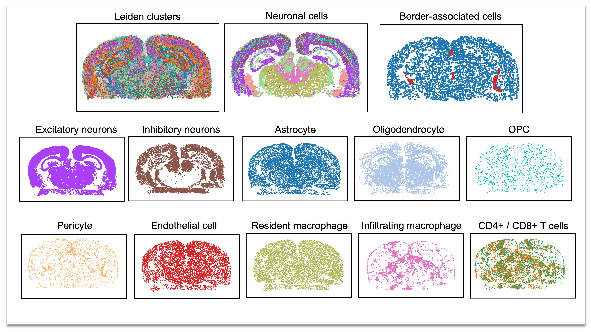

# About

This repository has been created as an open-science resource at the Center for Brain Immunology and Glia (BIG) and Neuroscience department at the University of Virginia. BIG is a community of biomedical researchers dedicated to the investigation of inflammatory processes across neurological conditions including brain infection and dementia. This repository houses a collection of data pipelines and example workflows that put together to support the  diverse transcriptomic and spatial biology experiments performed in the BIG Center.

# Data processing pipelines
1. `merfish-data`: Perform cellpose segmentation, data processing, and computational analysis on MERFISH data collected from control and T. gondii-infected mouse brains (Harris lab). Uploaded poster PDF for a comprehensive overview of the computational workflow.
   
2. `nanostring-cosmx-data`: Prepare and analyze Nanostring CosMx SMI data. Example workflow features a mouse brain dataset from an aging-associated Neuro-COVID19 project (Lukens lab).
   
3. `nanostring-geomx-data`: Prepare and analyze Nanostring GeoMx DSP featuring a dataset generated from the mouse olfactory system during SARS-CoV-2 infection (Lukens lab).
   
4. `scRNA-seq-data`: Run cellranger and single-cell analysis on 10x genomics data of immune that were FACS-sorted on CD45+ cells purified from T. gondii-infected mouse brains (Harris lab). Includes examples for trajectory inference analysis (RNA velocity).
   
5. `snRNA-seq-data`: Includes basic and in-depth analysis workflows using two datasets using genetic mouse models of Alzheimer's Disease (Lukens lab). The workflow for single nuclei RNA-sequencing data is very similar to single-cell, with additional considerations for QC parameters such as increased sparsity and lower mitochondrial read fraction.
   
6. `bulk-RNA-seq-data`: Start with .fastq files from paired-end sequencing files and run a trimmomatic-salmon pipeline. Read data into an R environment and proceed with a DESeq2-driven analysis. Also includes code for gene ontology overrepresentation analysis for differential expression results. 

# Other sections
1. `tools`: This section houses scripts for a collection of bioinformatics tools for single-cell analysis,  including cellranger, velocyto, and scvi-tools.
   
2. `visualization`: This section is subdivided into scripts, instructions, and figures for high-dimensional data visualization.

