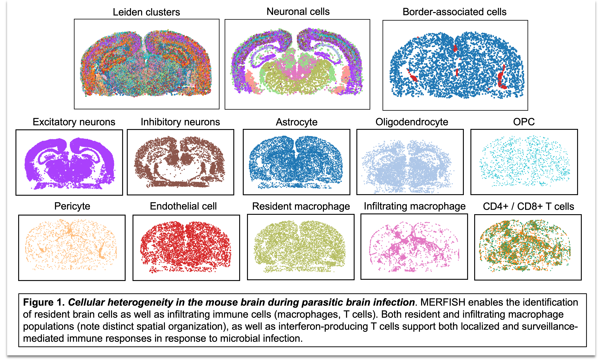

# Table of Contents
1. [About](#about) - Overview of the repository and its purpose, including the BIG Center and research focus.
2. [Code](#code) - Pipelines for transcriptomic and spatial biology analysis.
   - [Data Processing & Analysis Pipelines](#data-processing--analysis-pipelines) - Bulk RNA-seq, MERFISH, CosMx SMI, GeoMx DSP, scRNA-seq, snRNA-seq.
   - [Additional Code Sections](#additional-code-sections) - Visualizations (`visualization`), environment configurations (`envs`), and bioinformatics tools (`tools`).
3. [Experimental Design](#experimental-design) - Guidelines for designing transcriptomic experiments to ensure quality and reproducibility.
   - [Technology-specific Considerations](#technology-specific-considerations) - Best practices for bulk RNA-seq, single-cell/nuclei RNA-seq, and spatial transcriptomics.
   - [Best-practices for designing your experiment](#best-practices-for-designing-your-experiment) - Recommendations for robust analyses (e.g. replicates, controls).
   - [Wet-lab Best Practices](#wet-lab-best-practices) - Tips for preserving RNA integrity and transcriptional inhibitors.
4. [FAIR Data Principles](#fair-data-principles) - Ensuring adherence to FAIR standards (Findability, Accessibility, Interoperability, Reusability).
5. [Data Availability](#data-availability) - Links to publicly available datasets on GEO, most of which are generated in-house by BIG center trainees.
---

# About

I have developed this code repository as a shared resource for the **Center for Brain Immunology and Glia (BIG)**, the Neuroscience department at the University of Virginia (UVA), and the broader scientific research community. The BIG Center at UVA is a collaborative group of biomedical researchers dedicated to the investigation of the initiation, development, and regulation of **inflammatory processes** across diverse neurological states. BIG laboratories research fundamental principles of immunology as they pertain to preclinical experimental models for CNS infection, Alzheimer's disease, multiple sclerosis, traumatic brain injury, stroke, and epilepsy. 

## Code and Pipelines

This repository houses a collection of **data pipelines** and example workflows to support the computational analysis of diverse transcriptomic and **spatial biology experiments** performed in the BIG Center. All pipelines were built using **open-source tools**, particularly within the Python ecosystem, and leverage the `scverse` bioinformatics framework. Tools like `scanpy`, `squidpy`, and `scVI-tools` provide robust workflows for analyzing complex datasets. 

The modularity and **interoperability** of these tools ensure that each pipeline can easily be adapted or scaled, making them accessible and reusable for the broader research community. By integrating well-supported open-source software, these workflows are designed to meet high standards of **reproducibility** and flexibility.

## Experimental Design Considerations

In addition to the code, I’ve included practical suggestions for **experimental design** and **wet-lab tips** to ensure experiments are properly structured and of sufficient quality to support the desired downstream analyses. Whether you're working with bulk RNA-seq, single-cell RNA-seq, or spatial transcriptomics, designing the experiment with care can make all the difference in data quality and interpretability. [This section](#experimental-design) covers key topics such as the importance of replicates to ensure statistical robustness, the role of control groups to establish baseline comparisons, and **best practices** for maintaining RNA integrity throughout the experiment. By ensuring clean data collection, the bioinformatics analysis downstream is much more reliable.

## FAIR Data Principles

In line with the growing global movement toward open science, the data and code shared and referred to in this repository adhere to **FAIR data principles**: **Findability, Accessibility, Interoperability, and Reusability**. [FAIR principles](https://www.go-fair.org/fair-principles/) are designed to enhance the usability and transparency of scientific data, making it easier to share, cite, and build upon existing work. 

---

# Code

## Data Processing & Analysis Pipelines

### 1. `bulk-RNA-seq-data`
Start with .fastq files from paired-end sequencing and run a trimmomatic-salmon pipeline. Read data into an R environment and proceed with a DESeq2-driven analysis. Also includes code for gene ontology overrepresentation analysis for differential expression results. The featured dataset is a sequencing experiment from control and *T. gondii*-infected brains. This dataset (Harris lab) was generated to obtain infection-specific FPKM (abundance) values to guide the creation of 500 and 1000-plex MERFISH panels, with the goal of preventing optical crowding during data generation.

- **[Bulk-seq data pipeline](https://github.com/maureennc/big-omics-pipelines/tree/main/bulk-rna-seq-data)**

### 2. `merfish-data`
Perform segmentation, data processing, and computational analysis on in-house MERFISH data collected from control and *T. gondii*-infected mouse brains (Harris lab). Segmentation is performed on the Rivanna/Afton HPC using the cellpose 2.0 cyto2 algorithm via the Vizgen post-processing tool (VPT). After segmentation, transcripts are partitioned into cell boundaries. The dataset is imported into a Python environment and assembled into an AnnData object for single-cell and spatial analysis. See [MERFISH poster PDF](visualization/figures/MERFISH_HPC_Pipeline_Cowan_RCSymposium2024_poster.pdf) for a comprehensive overview of the computational workflow and pilot study results using a custom-designed 338-gene MERFISH panel.

- **[MERFISH data pipeline](https://github.com/maureennc/big-omics-pipelines/tree/main/merfish-data)**

### 3. `nanostring-cosmx-data`
Prepare and analyze Nanostring CosMx SMI data. The example workflow features Nanostring demo data and a mouse brain dataset from an aging-associated Neuro-COVID19 project (Lukens lab). CosMx data is pre-processed using AtoMx software with cellpose segmentation before transferring to an AWS S3 bucket for subsequent processing using a group-specific cloud-computing setup. Data exploration and analysis performed in Python.

- **[CosMx data pipeline](https://github.com/maureennc/big-omics-pipelines/tree/main/nanostring-cosmx-data)**

### 4. `nanostring-geomx-data`
Prepare and analyze Nanostring GeoMx Digital Spatial Profiler (DSP) data. ROI-based spatial data is analyzed using the `GeoMx tools` Bioconductor package. Workflow includes reading in data, filtering, Q3-normalization, and differential expression using LMMs. The featured dataset is from the mouse olfactory system during SARS-CoV-2 infection (Lukens lab). Advanced data visualization included transforming gene expression data into barycentric coordinates for three-way plotting using the [triwise](https://github.com/saeyslab/triwise) package.

- **[GeoMx data pipeline](https://github.com/maureennc/big-omics-pipelines/tree/main/nanostring-cosmx-data)**

### 5. `scRNA-seq-data`
Run cellranger and perform single-cell analysis on our in-house 10x Genomics data generated in collaboration with  [UVA's Sequencing Core](https://med.virginia.edu/gatc/). The dataset features immune cells FACS-sorted from *T. gondii*-infected mouse brains (Harris lab). Data cleaning involves filtering on QC parameters using a dynamic quantile approach and scrublet for doublet detection. This section includes example scripts for cell type annotation and identification and differential expression. Trajectory inference analysis (RNA velocity) is performed to examine the microglial transition from homeostatic to a neurodegeneration-associated transcriptional state during parasitic infection using tools including samtools, velocyto, and scVelo. Analysis and visualization performed in Python and R.

- **[scRNA-seq data pipelines](https://github.com/maureennc/big-omics-pipelines/tree/main/scRNA-seq-data)**

### 6. `snRNA-seq-data`
Includes basic and in-depth analysis workflows using two datasets from transgenic mouse models of Alzheimer's Disease (Lukens lab). The workflow for single nuclei RNA-sequencing data is similar to single-cell, but with differences in the cell type composition due to the prep's ability to isolate nuclei from cells that do not dissociate well from tissue (neurons, astrocytes, etc.) in addition to immune cells. Additional considerations include increased sparsity and QC parameters such as lower mitochondrial read fraction.

- **[snRNA-seq data pipelines](https://github.com/maureennc/big-omics-pipelines/tree/main/snRNA-seq-data)**

---

## Additional Code Sections

### 1. `visualization`
This section contains scripts and figures related to visualizing high-dimensional data. See my [quick-guide instructions](visualization/instructions/vizgen-vizualizer-software-instructions.md) for using Vizgen's `Vizualizer` software to interact with MERFISH data and export polygon geometries for custom spatial analyses.

### 2. `envs`
This section contains .yaml files for the conda virtual environments used on AWS, Rivanna HPC, and my local device (MacBook, M1 Max).

### 3. `tools`
This section houses scripts for using and manipulating data with different bioinformatics tools, including cellranger, velocyto, scrublet, and scvi-tools.

---

# Experimental Design

When planning your experiments, it’s critical to plan and design them in a way that directly supports the analyses you want to perform. This means thinking ahead about how your data will be processed and analyzed, and ensuring that the experimental structure allows for those goals to be met effectively.

## Technology-specific considerations

What are these different transcriptomics technologies and in what contexts can they be leveraged to answer a specific experimental question?

1. **Bulk RNA Sequencing**: Bulk sequencing is ideal for capturing average gene expression across a tissue sample. It's a go-to method when you're studying processes that involve large populations of cells and when cellular heterogeneity is not your focus. It's particularly useful when the goal is to identify generalized gene expression profiles or pathway activity in a specific tissue (e.g., identifying differentially expressed genes in a tumor compared to healthy tissue). This method generally offers excellent detection sensitivity to biological signal since inherent noise in the dataset are averaged over many, many cells.

2. **Single-Cell RNA Sequencing (scRNA-seq)**: scRNA-seq is essential when you need to explore the cellular heterogeneity within a sample. It allows for the identification of distinct cell populations and rare cell types, making it ideal for studies where understanding cell type-specific responses is critical, such as in the immune response or in tumor microenvironments. Use single-cell sequencing when your experiment requires dissecting the complexity of cellular populations, such as identifying specific cell types or states in the context of disease progression, tissue development, or immune responses.

3. **Spatial Transcriptomics (e.g., MERFISH, CosMx, GeoMx DSP)**: Spatial transcriptomics is key when it’s important to know where specific gene expression occurs within the tissue. These technologies allow you to measure gene expression in situ, preserving the spatial context of the tissue. This is crucial when studying how cellular localization impacts biological processes, such as in brain tissue where neuron-glia interactions are highly spatially regulated. Use spatial transcriptomics if you're investigating the spatial organization of gene expression within a tissue. It’s particularly relevant in research areas like neurobiology, cancer biology (e.g., studying tumor-immune cell interactions), and tissue development, where spatial architecture plays a critical role in cell function and behavior.

   - **MERFISH**: Ideal for generating high-resolution spatial maps of gene expression, MERFISH provides near single-cell resolution and exhibits high sensitivity, making it well-suited for detecting small but biologically meaningful changes, such as subtle shifts in transcription factor expression. To maximize the utility of MERFISH, designing a targeted gene panel is key. This panel should be informed by bulk and single-cell RNA-seq data from your specific tissue and disease context, ensuring that you include genes that allow for the identification of unbiased and biologically relevant cell populations.
   - **CosMx SMI**: Useful for multiplexed analysis, especially when combining transcriptomics and proteomics for spatial insights at subcellular resolution. Nanostring designs a standard mouse brain panel and allows you to spike-in probes for additional genes of interest to study specific inflammatory processes of interest. In my experience, CosMx data that we have generated has been of roughly single-cell resolution. Like with MERFISH, cellpose segmentation is supported.
   - **GeoMx DSP**: GeoMx is a strong option for region-specific analysis, especially if you are interested in studying larger tissue regions and need to combine gene expression data with morphological features (e.g., from immunohistochemistry). Similar to bulk RNA-seq, GeoMx DSP provides an averaged gene expression profile over a targeted area, but unlike bulk RNA-seq, it retains spatial context by targeting specific regions within the tissue. This allows you to connect gene expression data to tissue architecture. Additionally, GeoMx can profile both RNA and protein, providing a more detailed multimodal view of the tissue environment.

## Best-practices for designing your experiment
1. **Replicates**: Always try to include replicates in your experimental design. Replicates help smooth out technical noise, making sure that any observed differences aren’t just random errors or batch effects from sequencing. This makes your data more reliable for downstream analyses. Plus, including replicates allows you to ask more meaningful questions. For instance, with biological replicates, you can explore whether the gene expression changes you’re seeing are consistent across individuals or if there’s some variability. This gives you the ability to perform more sophisticated statistical analyses, like mixed-effects models, that can pick up on more subtle differences and help identify patterns you wouldn’t catch with just one sample.

2. **Control groups / samples**: It’s important to always include control groups in your experimental design. They help you establish the statistical significance of your findings and also validate your dataset. For example, if you’re studying a mouse model of Alzheimer’s disease and are trying to understand the effect of a treatment, it’s incredibly useful to have control, undiseased brain tissue. This lets you compare healthy versus diseased conditions, so you can see how large and significant the treatment’s effects are relative to an informative baseline. Having these control comparisons is key to interpreting the real impact of your intervention as it relates to the transcriptional changes being measured.

## Wet-lab best-practices
1. **RNase-free environments**: RNA is extremely fragile and prone to degradation by RNases, which are abundant in most lab environments. Try your best to ensure an RNase-free environment by using dedicated RNase-free reagents and equipment. Products like RNase Zap are essential for cleaning surfaces, pipettes, and even gloves to minimize contamination. RNase-free tubes, tips, and solutions should be used from start to finish to prevent RNA degradation and maintain sample integrity. While these extra precautions may seem repetitive, they are fundamental to producing and reproducing results you can trust.

2. **Transcriptional inhibitors**: When conducting RNA-sequencing experiments, especially from brain tissue, consider using transcriptional inhibitors like Actinomycin D. For sequencing microglia, I like to add Actinomycin D to my media (3μM) and during the enzymatic digestion stage (45 μM) to inhibit the upregulation of immediate early activation genes associated with dissue dissociation techniques and  FACs sorting. Microglia in particular have been shown to have an activation signature induced by the prep alone and validated using techniques like ribo-tag.

   
# Data availability
The datasets associated with the code in this repository are available on GEO (Gene Expression Omnibus):

- **GSE146680**: Gasdermin-D-dependent IL-1 alpha release from microglia promotes protective immunity during chronic *Toxoplasma gondii* infection.  
  [Link to dataset](https://www.ncbi.nlm.nih.gov/geo/query/acc.cgi?acc=GSE146680)
  
- **GSE204751**: Transcriptomic analysis of wild-type microglia isolated from fluorescent reporter mice.  
  [Link to dataset](https://www.ncbi.nlm.nih.gov/geo/query/acc.cgi?acc=GSE204751)
  
- **GSE203655**: Microglial STAT1-sufficiency is required for resistance to toxoplasmic encephalitis.  
  [Link to dataset](https://www.ncbi.nlm.nih.gov/geo/query/acc.cgi?acc=GSE203655)
  
- **GSE207173**: Single-cell sequencing of splenocytes following *T. gondii* infection.  
  [Link to dataset](https://www.ncbi.nlm.nih.gov/geo/query/acc.cgi?acc=GSE207173)
  
- **CosMx SMI Mouse Brain FFPE Dataset**: Coronal hemisphere, CosMx Mouse Neuroscience Panel
  [Link to dataset](https://nanostring.com/products/cosmx-spatial-molecular-imager/ffpe-dataset/cosmx-smi-mouse-brain-ffpe-dataset/)

Some datasets related to the code in this repository are part of ongoing research by doctoral trainees and have yet to be published. As these projects are completed and the datasets are deposited into public repositories, this section will be updated with the relevant links. Please check back for updates.
