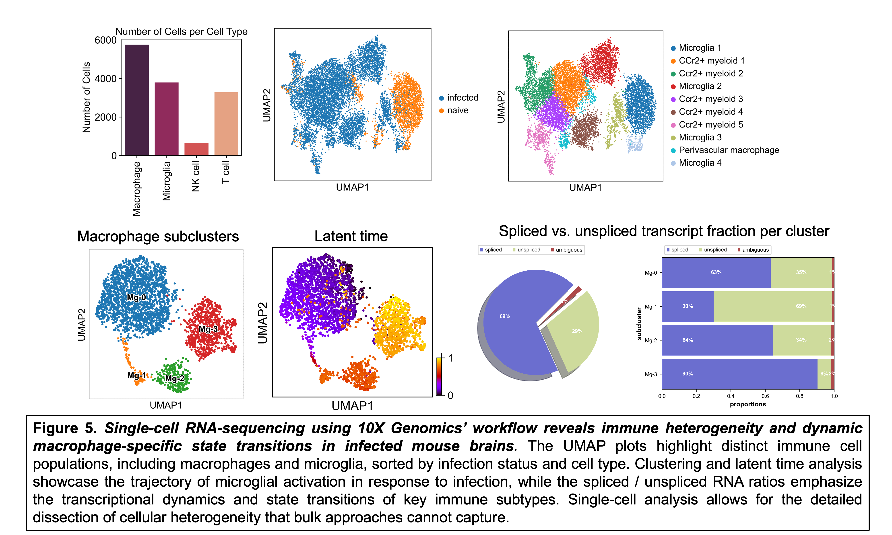

# About

I have developed this code repository as a shared resource for the Center for Brain Immunology and Glia (BIG), the Neuroscience department at the University of Virginia, and the broader scientific research community. BIG is a community of biomedical researchers dedicated to the investigation of inflammatory processes across neurological diseases, including infection and neurodegeneration. This repository houses a collection of data pipelines and example workflows put together to support the computational analysis of diverse transcriptomic and spatial biology experiments performed in the BIG Center.

# Data processing pipelines
## 1. `bulk-RNA-seq-data`
Start with .fastq files from paired-end sequencing and run a trimmomatic-salmon pipeline. Read data into an R environment and proceed with a DESeq2-driven analysis. Also includes code for gene ontology overrepresentation analysis for differential expression results. Featured dataset is a sequencing experiment from control and T. gondii-infected brains. The featured dataset (Harris lab) was generated to obtain infection-specific FPKM (abundance) values to guide in the creation of 500 and 1000-plex MERFISH panels, with the goal of preventing optical crowding during data generation. 

## 2. `merfish-data`
Perform segmentation, data processing, and computational analysis on in-house MERFISH data collected from control and T. gondii-infected mouse brains (Harris lab). Segmentation is performed on the Rivanna/Afton HPC using the cellpose 2.0 cyto2 algorithm via the Vizgen post-processing tool (VPT). After segmentation, transcripts are partitioned into cell boundaries. The dataset is imported into a Python environment and assembled into an AnnData object for single-cell and spatial analysis. See [MERFISH poster PDF](visualization/figures/MERFISH_HPC_Pipeline_Cowan_RCSymposium2024_poster.pdf) for a comprehensive overview of the computational workflow and pilot study results using a custom-designed 338-gene MERFISH panel. This pipeline will support our newly developed 1k-plex MERFISH panel to study shared inflammatory processes in CNS infection Alzheimer's Disease.

   
## 3. `nanostring-cosmx-data`
Prepare and analyze Nanostring CosMx SMI data. Example workflow features Nanostring demo data and a mouse brain dataset from an aging-associated Neuro-COVID19 project (Lukens lab). CosMx data is pre-processed using AtoMx software wth cellpose segmentation prior to transfer to an AWS S3 bucket for subsequent processing using a lab-specific cloud-computing infrastructure. Data exploration and analysis performed in Python.
   
## 4. `nanostring-geomx-data`
Prepare and analyze Nanostring GeoMx Digital Satial Profiler (DSP) data. ROI-based spatial data is analyzed using the `GeoMx tools` bioconductor package. Workflow includes reading in data, filtering, Q3-normalization, and differential exprssion using LMMs. Featured dataset generated from the mouse olfactory system during SARS-CoV-2 infection (Lukens lab) and analysis performed in R. Given the use of three comparison groups, this dataset was amenable to advanced data visualization that included transformation of gene expression data into barycentric coordinates for three-way plotting using the [triwise](https://github.com/saeyslab/triwise) package. See [GeoMx analysis vignette](https://www.bioconductor.org/packages/release/workflows/vignettes/GeoMxWorkflows/inst/doc/GeomxTools_RNA-NGS_Analysis.html#Analyzing_GeoMx-NGS_RNA_Expression_Data_with_GeomxTools).
   
## 5. `scRNA-seq-data`
Run cellranger and perform single-cell analysis on our in-house 10x Genomics data generated in collaboration with UVA's Genome Analysis and Technology Core (GATC). Dataset features immune cells that were FACS-sorted from T. gondii-infected mouse brains (Harris lab). Data cleaning involves filtering on QC parameters using a dynamic quantile approach that scales to each sample, and scrublet for doublet detection. This section includes example scripts for cell type annotation and identification and differential expression. Trajectory inference analysis (RNA velocity) is performed to examine the microglial transition from homeostatic to a neurodegeneration-associated transcriptional state during parasitic infection using tools including samtools, velocyto and scVelo. Analysis and visualization performed in Python and R.

   
## 6. `snRNA-seq-data`
Includes basic and in-depth analysis workflows using two datasets using transgenic mouse models of Alzheimer's Disease (Lukens lab). The workflow for single nuclei RNA-sequencing data is very similar to single-cell, but with differences in the cell type composition due to the prep's ability to isolate nuclei from cells that do not otherwise dissociate well from tissue (neurons, astrocytes, etc) in addition to immune cells. For nuclear data there are additional considerations like increased sparsity and QC parameters such as lower mitochondrial read fraction. Analysis performed in Python and visualization in R.
   

# Other
## 1. `visualization`
This section is subdivided into scripts and figures related to visualizing high-dimensional data. Also see my [quick-guide instructions](visualization/instructions/vizgen-vizualizer-software-instructions.md) for using Vizgen's `Vizualizer` software for (1) interacting with MERFISH data, (2) importing processed .hdf5 files (cleaned and annotated data) into the software, and (3) using the GUI to create and export polygon geometries for custom spatial analyses using spatial coordinates for compatibility with single-cell workflows.

## 2. `envs`
This section contains .yaml files for the conda virtual environments used on AWS, Rivanna HPC, and my local device (MacBook, M1 Max). Documenting specific versions of different packages is key for reproducibility.

## 3. `tools`
This section houses scripts for using and manipulating data with different bioinformatics tools for single-cell analysis, including cellranger, velocyto, scrublet, and scvi-tools.

