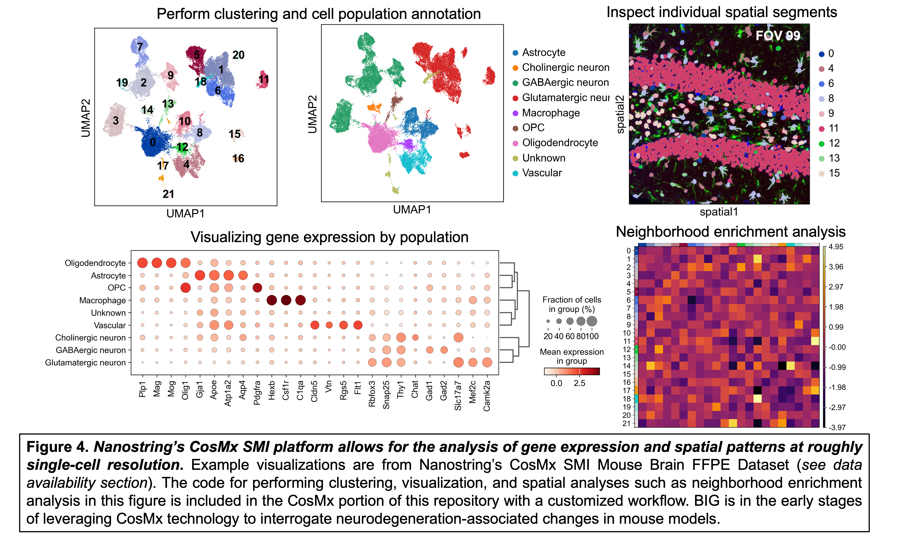

# CosMx Data

## Overview
Prepare and analyze Nanostring CosMx SMI data. The example workflow features Nanostring demo data and a mouse brain dataset from an aging-associated Neuro-COVID19 project (Lukens lab). CosMx data is pre-processed using AtoMx software with cellpose segmentation before transferring to an AWS S3 bucket for subsequent processing using a group-specific cloud-computing setup. Data exploration and analysis performed in Python.

- See `cosmx-demo-data-analysis.py` for a good overview of CosMx scripting analysis (this script is linked to the figure above).

## Data availability
The following dataset is publicly available on Nanostring's website:
- **CosMx SMI Mouse Brain FFPE Dataset**: Coronal hemisphere, CosMx Mouse Neuroscience Panel
  [Link to dataset](https://nanostring.com/products/cosmx-spatial-molecular-imager/ffpe-dataset/cosmx-smi-mouse-brain-ffpe-dataset/)
  
