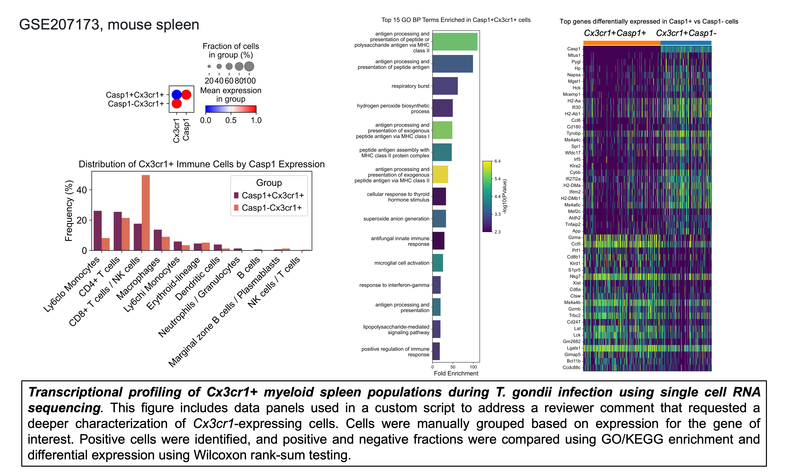

# Single cell RNA-Sequencing

## Computational Workflow

### `basic-workflow`
Basic analysis pipelien for single cell RNA seq data.

- `01_cellranger.sh`: This script runs 10X Genomics' cellranger pipeline, aligning raw FASTQ files to the mm10 genome and quantifying gene expression while identifying cells vs empty droplets.
- `02_sc-pp.py`: This script pre-processes the data by importing gene expression and protein data, performing basic quality control (QC) filtering, detecting and filtering doublets, normalizing the data, selecting highly variable genes, and exporting the processed data as AnnData objects for downstream analysis.
- `03_sc-seq.py`: This script trains a scVI model on the single-cell data, annotates Leiden clusters, performs differential expression to identify marker genes, and exports processed data and marker gene results for downstream analysis.

### `RNA-velocity-example`
Similar to `basic-workflow` but includes a trajectory inference analysis / RNA velocity analysis. I used a velocyto-scVelo workflow. I made edits to the mm10 `.gtf` annotation file due to how `velocyto` reads mitochondrial reads differently than the new 10x `cellranger count` pipeline. Here are the scripts:

- `01_cellranger.sh`: This script runs 10X Genomics' cellranger pipeline, aligning raw FASTQ files to the mm10 genome and quantifying gene expression while identifying cells vs empty droplets.
- `02_samtools.sh`: This SLURM script runs samtools to sort a BAM file by the cell barcode `CB` tag (which stands for "[sort by] cell barcode"), using 7 threads and outputs the sorted file to a specified directory. This is a workaround for the default `samtools` version on Rivanna.
- `03_velocyto`: Run velocyto directly on the 10x output folder and it will generate `.loom` files.
- `03_velocyto-multi`: Run velocyto directly on the 10x output folder, but using a `SLURM` array.
- `04_sc-pp`: This script pre-processes the data by importing gene expression and protein data, performing basic quality control (QC) filtering, detecting and filtering doublets, normalizing the data, selecting highly variable genes, and exporting the processed data as AnnData objects for downstream analysis.
- `05_sc-seq`: This script trains a scVI model on the single-cell data, annotates Leiden clusters, performs differential expression to identify marker genes, and exports processed data and marker gene results for downstream analysis.
- `06_sc-velocity`: This script performs trajectory inference calculations and data visualizations on microglia using scVelo's dynamical model.

### `ppath-reviewer-comments`

